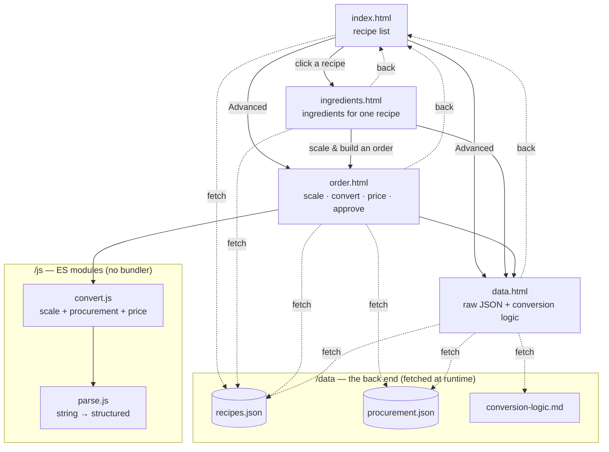
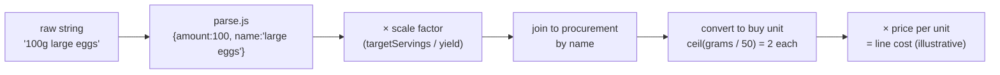

# recipe-web-page-demo

A small recipe web app built as a kata assessment for an AI Engineer role. It
takes a messy, hand-written meal plan and turns it into a browsable site — list a
recipe, read its ingredients, and (beyond the brief) scale it into a costed
procurement order. Static HTML + vanilla JavaScript, **no build step**, deployed
to Azure Static Web Apps by CI/CD on every push to `main`.

**Live:** https://yellow-field-01e27460f.7.azurestaticapps.net/

| Page | Live link |
|---|---|
| Recipe list | [`/`](https://yellow-field-01e27460f.7.azurestaticapps.net/) |
| Ingredients | [`/ingredients.html?id=chicken-stir-fry`](https://yellow-field-01e27460f.7.azurestaticapps.net/ingredients.html?id=chicken-stir-fry) |
| Order builder (advanced) | [`/order.html`](https://yellow-field-01e27460f.7.azurestaticapps.net/order.html) |
| Data & logic (advanced) | [`/data.html`](https://yellow-field-01e27460f.7.azurestaticapps.net/data.html) |

---

## What it does

**Required (the graded brief):**
- A page listing the available recipes, stored in the "back end."
- Clicking a recipe takes you to its ingredients.

**Advanced (beyond the brief — to show where this goes):**
- **Order builder** — scale a recipe to any serving count, convert recipe grams
  into the unit each ingredient is actually *purchased* in (eggs by the each,
  oil by the millilitre, bulk items by weight), attach an illustrative price, and
  require a human **Approve** before anything reads as "ordered."
- **Data & logic** — the raw JSON the app runs on, shown next to the plain-English
  conversion logic, so the system documents itself.

## The interesting problem

The supplied meal plan was deliberately messy: malformed JSON, and ingredient
strings like `"100g large eggs"` and `"3g Salt and pepper (to taste)"`. Two real
procurement problems fall out of that:

1. **Recipe units aren't purchase units.** You don't buy eggs by the gram. The app
   keeps a `procurement.json` table that maps each ingredient to how it's bought
   and rounds countables *up* (no fractional eggs).
2. **Ambiguous lines.** `"Salt and pepper"` is two SKUs at very different prices
   sharing one weight. The app splits it into two separately-priced lines (an even
   split by weight as a neutral default) that a human can adjust — it never silently
   guesses one number into an order.

Prices and conversions are **illustrative and labeled as such** everywhere; real
values would come from a supplier catalog.

---

## Architecture

- **No framework, no bundler, no server.** Plain HTML, ES-module JavaScript, one
  CSS file. The whole thing is static assets.
- **The repo is the data store.** JSON in `/data` is committed, served as static
  files, and `fetch()`ed at runtime. "In-memory dictionaries will do," per the
  brief — modeled here as flat JSON.
- **Logic lives in two modules.** `js/parse.js` structures the raw ingredient
  strings (and preserves the original string, so any parsed value is auditable);
  `js/convert.js` scales, joins to procurement by name, and prices each line.
- **A real CI gate.** `scripts/ci_checks.py` runs both locally and in CI: it checks
  the page exists and isn't empty, scans for leaked secrets, and asserts the data
  obeys the kata's rules (recipe shape, illustrative-price labels, the bundled
  salt/pepper modeling). A non-compliant data change **fails the build** before it
  can deploy.

See the [structure diagram](#structure-diagram) and the
[evolution](#how-it-was-built) at the bottom.

### Project layout

```
index.html               # recipe list (required)
ingredients.html         # ingredients for one recipe (required)
order.html               # advanced: scale · convert · price · approve
data.html                # advanced: raw JSON + rendered conversion logic
styles.css               # one shared stylesheet
staticwebapp.config.json # routing (404s /docs/* so dev docs aren't served live)
data/                    # the "back end", fetched at runtime
  recipes.json           #   cleaned meal plan (ingredient strings preserved)
  procurement.json       #   unit conversions + illustrative prices
  conversion-logic.md    #   plain-English logic, rendered into data.html
js/
  parse.js               # ingredient string -> { amount, unit, name, note, flags }
  convert.js             # scaling + procurement conversion + order build
scripts/
  ci_checks.py           # validation gate (same script CI runs)
docs/                    # process artifacts (see "How it was built")
  kata-rules.md          #   each rule -> where it's enforced
  STYLE_GUIDE.md         #   the documentation standard used here
  Brutal_Improvements.md #   a self-critique pass and its fixes
  decisions/             #   dated decision records for each pivot
.github/workflows/       # CI gate + Azure SWA deploy
CLAUDE.md                # architecture map / maintainer notes
```

---

## Run it locally

It's static, but the pages `fetch()` JSON, which fails on `file://`. Serve over HTTP:

```bash
# any static server works, e.g.:
python3 -m http.server 8080
# then open http://localhost:8080
```

Run the validation gate (the same one CI runs):

```bash
python3 scripts/ci_checks.py
```

There's no JS test framework; `ci_checks.py` is the test suite, and the conversion
math is small enough to verify by reading `js/convert.js`.

## Deploy

Push to `main` → GitHub Actions (`.github/workflows/deploy.yml`) deploys to Azure
Static Web Apps in ~1 minute. Pull requests get an isolated staging environment
that's torn down on close. The only link between GitHub and Azure is the
`AZURE_STATIC_WEB_APPS_API_TOKEN` repo secret.

- **Resource group:** `rg-recipe-web-page-demo` · **SWA:** `recipe-web-page-demo`
  (Free SKU, East US 2) · **Subscription:** Personal Portfolio

## License

MIT — see [`LICENSE`](LICENSE).

---

## How it was built

I'm not hiding the method: this was built **AI-assisted, with Claude Code**, but run
like real engineering rather than one-shot prompting. Every change went through a
**reviewed pull request**, deployed to an **Azure staging environment** first, and
carried a **dated decision record** in `docs/decisions/` explaining the *why* (and,
where I reversed an earlier choice, what superseded it). Midway through I ran a
deliberate **self-critique pass** (`docs/Brutal_Improvements.md`) that caught
documentation that had drifted out of sync with the code, and fixed it.

What I think that demonstrates: working *with* an AI productively still comes down
to engineering discipline — small reviewable units, verify-before-claiming, keep the
docs honest, and let human judgment override the process when the requirement is
genuinely ambiguous.

The artifacts that show the process are intentionally kept in the repo:
`docs/decisions/` (the reasoning), `docs/kata-rules.md` (rule → enforcement map),
`docs/STYLE_GUIDE.md` (the standard every file follows), and `CLAUDE.md` (the
architecture map the AI and I both worked from).

### Evolution

Built iteratively; each step was its own PR. Note the reversals — they're
responses to feedback, which is the point.

| # | Step | Why |
|---|---|---|
| — | **Scaffold** | A placeholder page + Azure SWA CI/CD + the validation-gate skeleton. |
| **1** | **Build the kata app** | Required list → ingredients flow, plus the advanced order and data pages, the `parse`/`convert` modules, and a CI gate enforcing the brief's data rules. |
| **2** | **Two literal pages** | Read the brief literally — split "the recipe page" and "the ingredients page" into two. |
| **3** | **Straight to ingredients** | Reversed #2: clicking a recipe should go *straight* to its ingredients — dropped the middle page. |
| **4** | **Fix split repricing; plain ingredients** | Fixed a bug where the salt/pepper split didn't re-cost; stripped data-quality flags off the ingredients page (the brief wants a plain listing). |
| **5** | **Simplify salt/pepper** | Replaced a fiddly inline split editor with two priced lines + a one-line explanation; deleted the now-unused approval-rules module. |
| **6** | **Shared CSS + editable lines + self-critique** | Collapsed ~150 lines of per-page CSS into one stylesheet; made ambiguous lines editable (working this time); folded in the brutal-critic pass that fixed stale docs and added the style guide + per-function `WHAT/WHY` comments. |
| **7** | **Complete the breadcrumbs** | Every page reachable both ways; `order.html` gained a recipe picker so it's reachable from the index; navigation comments verified against the real link graph. |

---

## Structure diagram

Navigation between pages (solid = link, dashed = "back"), and what each page
fetches from the `/data` back end.



Order-line data flow, for one ingredient:


